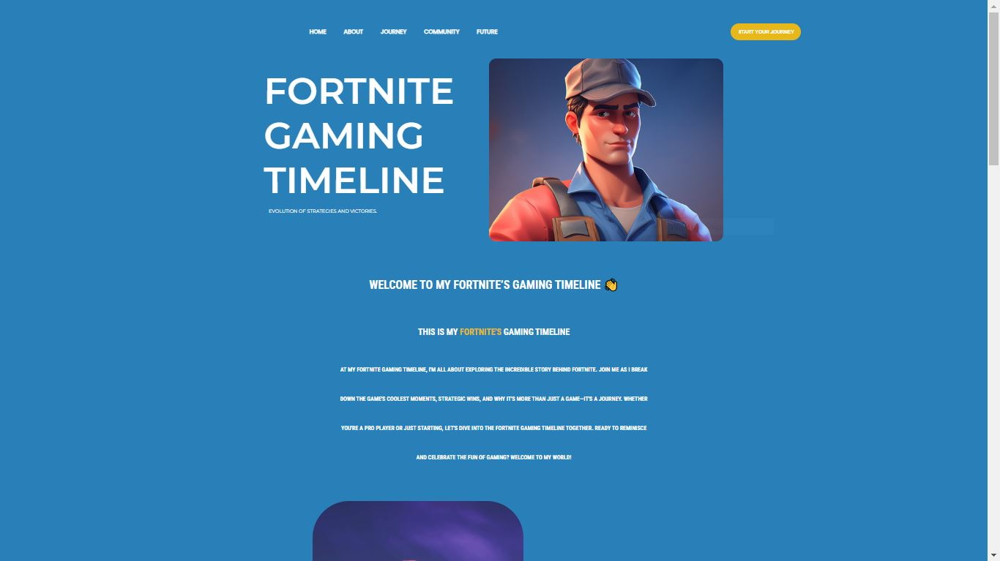

# Fortnite TimeWarp: A Comprehensive Gaming Timeline




## Description
Welcome to my Gaming Journal! It's a simple and friendly website where I share my gaming journey, fun moments with friends, and connect with other gamers. Easy to use, full of pictures, and a great way to join the gaming community. Let's explore and game on together!

## Features

✅ **User-Friendly Navigation:** Easily explore different sections of the timeline.

✅ **Engaging Hero Banner:** Capture attention with a visually appealing hero section.

✅ **Personalized Journey:** Share your Fortnite story from early experiences to advanced strategies.

✅ **Visual Storytelling:** Use visuals and storytelling for an immersive experience.

✅ **Interactive Journey Overview:** Explore key milestones and defining moments.

✅ **Community Showcase:** Highlight squad moments and build real friendships.

✅ **User Engagement:** Share your victories and challenges for a thriving community.

✅ **Sneak Peek:** Preview future quests and challenges.

✅ **Google Fonts Integration:** Enhance aesthetics with Montserrat, Roboto Condensed, and Poppins.

✅ **Smooth Scrolling:** Polished and enjoyable user experience.

✅ **Call-to-Action Button:** Engage with a "Start Your Journey" button.

## Technologies Used

- **HTML5** 
- **CSS3**
- **Google Fonts**

# Usage

## Demo
You can find the demo video <a href="https://youtu.be/_aj4C3FqsgI?si=pv6NSOmaL4P7dvUr" target=_blank>Here</a>

## User Guide
Effortlessly explore each section with the intuitive navigation links located at the top of the page.

## Development

### Prerequisites
Before you begin, ensure you have the following installed:

- [Web Browser](https://www.google.com/chrome/): for viewing and testing the project.

### Cloning the Repository
1. Clone the repository to your local machine:
   ```bash
   git clone https://github.com/saeedhalabi/Frontend-Learning-project.git

### Navigate the Project Directory
<code>cd Frontend-Learning-project</code>

### Running the Project Locally
1. Open the project folder in your preferred code editor.
2. Locate the <code>index.html</code> file and open it with your web browser.
3. Explore the Fortnite Gaming Timeline locally on your machine.

## Figma Design

Explore the visual design and layout of the Fortnite TimeWarp project on Figma. Click the link below to view the Figma design:

[Figma Design](https://www.figma.com/file/XTIleSMn2OMkGh9xuMqbsb/Fortnite-Gaming-Timeline?type=design&node-id=0%3A1&mode=design&t=0ID5rD3RGKTEf5Ee-1)


# Learnings, Applications used, and Challenges

### What I Learned
Throughout the development of the Fortnite TimeWarp project, I gained valuable insights and skills in:

- HTML5 for structuring the content of the web pages.
- CSS3 for styling and layout, enhancing the visual appeal of the website.
- Integrating Google Fonts to improve the typography and overall design.
- Implementing smooth scrolling for a polished user experience.
- Learned how to structure elements using Flexbox
- HTML Class naming conventions

### Application Used
The project leveraged the following application:

- Visual Studio Code (VSCode)
  - developed by Microsoft, is a popular and versatile source code editor known for its lightweight design, extensive features, and robust support for various programming languages.

## Challenges Faced

- Flexbox
  - Customizing layouts to make them look good
  - Organizing stuff on the page by using containers
- Making the text look nice by enhancing typography
- Using git to share and commit my work

Despite these challenges, each hurdle provided an opportunity for growth, skill development, and a more robust understanding of web development principles.

# Disclaimer

<div style="border: 2px solid red; padding: 10px;" class="disclaimer">

This project is not designed to be responsive. It may not display optimally on various devices and screen sizes. Please use a desktop or laptop for the best experience.

</div>
